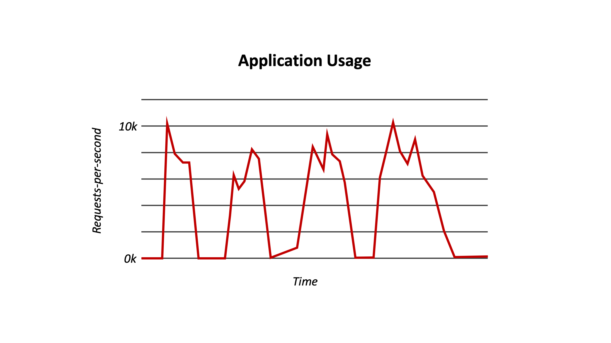
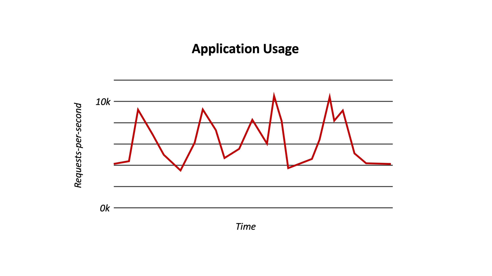
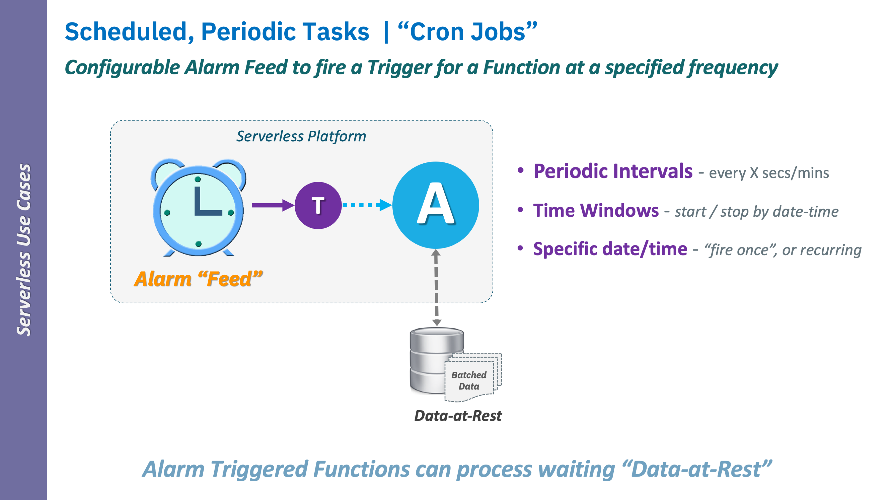
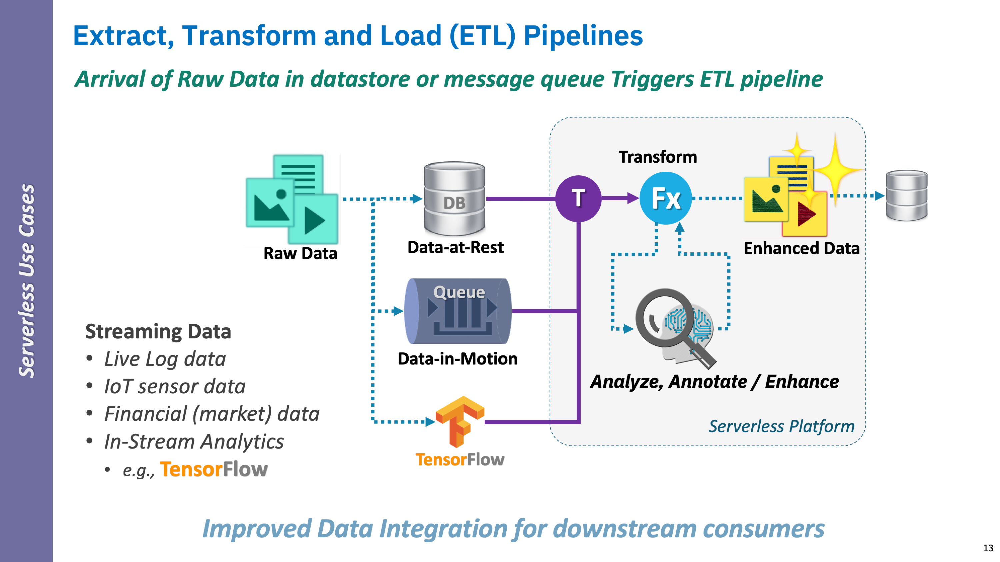
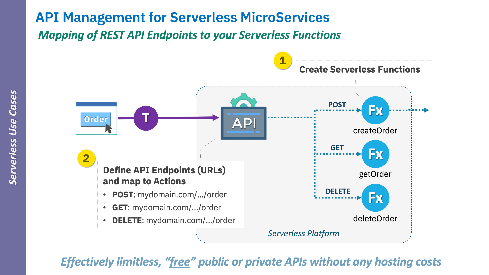
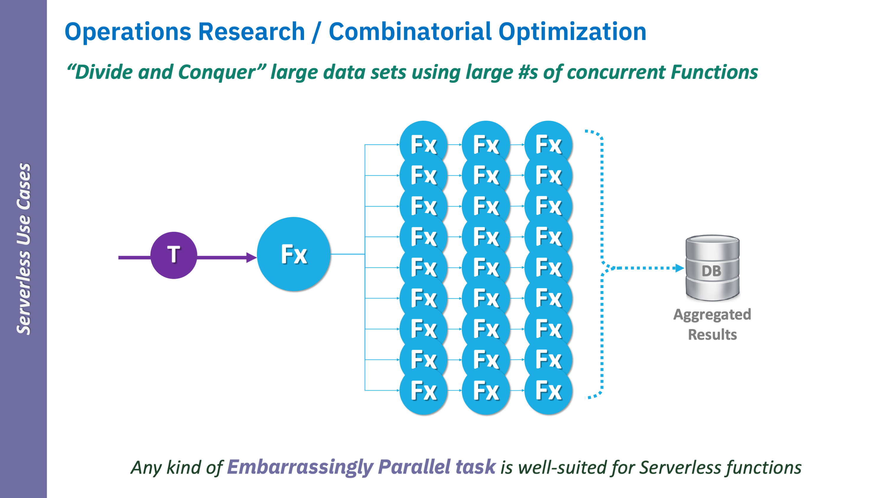

<!--
#
# Licensed to the Apache Software Foundation (ASF) under one or more
# contributor license agreements.  See the NOTICE file distributed with
# this work for additional information regarding copyright ownership.
# The ASF licenses this file to You under the Apache License, Version 2.0
# (the "License"); you may not use this file except in compliance with
# the License.  You may obtain a copy of the License at
#
#     http://www.apache.org/licenses/LICENSE-2.0
#
# Unless required by applicable law or agreed to in writing, software
# distributed under the License is distributed on an "AS IS" BASIS,
# WITHOUT WARRANTIES OR CONDITIONS OF ANY KIND, either express or implied.
# See the License for the specific language governing permissions and
# limitations under the License.
#
-->

# OpenWhisk - Knative Functions WG demo

## Credit Last Week’s Demo (Lionel)

- Moving some OpenWhisk’s basic concepts using Kube/Knative providing
- **“Runtime proxy” approach**
    - _**Invisible proxy**_ (Docker layer) in runtime to simplify/normalize functionality to functions
    - Mostly _**platform agnostic**_ no added code needed" approach
    - _**Parameter passing**_, _**Parameter binding**_
- **CRD** - that acts as a _basic "controller"_
    - Simplifies Kube/Knative interactions (from CLI)
    - Config mgmt. - binding configs to params for function
    - Launch Knative Services "ksvc” - for named functions
- **Compositions**
    - _Supported by backend (state) were important_
    - _Fundamentally, agreed with "tree/branching" use case (Max), but more…_

---

## OpenWhisk Approach

### Developer-centric

- _**Everything we do is for **Developer simplicity**_

  - _**Developer only codes functions in their chosen language**_
     - _No directives | pragmas | annotations_
     - Utilize normal language module/package imports
        - May provide platform callbacks/intrinsic functionality (as functions)
  - _**Developer has NO knowledge of**_
     - Operating System (OS)
     - Platform (implementation)
        - _Kube | Knative | Firecracker, etc._
     - Container (VM tech.)
     - (Micro)Service Framework
  - _Minimalistic archive “zip” packaging from CLI

### Observer Pattern: Event driven / Reactive

It's all about an eventing framework that scales as fast as possible!

   - **Observer pattern** reflected in Programming Model
      - Informs design of control and data plane (for FaaS platform)
   - **Reactive**
      - as expected by microservices; these developers will migrate to FaaS
      - moving "up the stack" for the developer... no more Pflask... etc.
      - Cold start reduction is paramount!
   - **Event format agnostic**
      - Cannot force everyone to single event format; either impractical to change
        - cannot suffer performance (transforms)...
        - functions are often coupled with specific data (e.g., from IoT sensor events or data sets), e.g.,
        **NASA PIXL**, raw NoSQL data, analytics models, genetic model data)
            - **[NASA Rover PIXL](https://mars.nasa.gov/mars2020/spacecraft/instruments/pixl/)**
   - **HTTP / Web accessible without APIs**
        - _functions creating/modifying/serving http `content-type` web data_
   - **Edge accessible**
      - IoT events (network response time sensitve)

## Driven by Serverless Use Cases

   - Informed by experience of OW and production usage for ~4 years

---

## Serverless Patterns

### Unpredictable, sporadic (even aperiodic embarrassingly parallel workloads)

### Anti-pattern - High volume, continuous requests

### Key Use Cases

Reflect the top reasons Developers move "up-the-stack"

- Minimize compute costs (smallest possible per-invocation charge)
  - Manage unpredictability, sporadic loads (events sporadic)
  - Horizontal Scaling to N (up to account limits), to 0

#### Alarm | Periodic

  - "batch jobs"

  

#### ETL Pipelines

  - Changes in Data-at-Rest, Data-in-Motion "trigger" functions

  

#### Serverless APIs

  - OpenAPI, Security, Rate limiting pushed to edge,
  - Easily interfaced with host IAM systems

  

#### Embarrassingly parallel workloads

  - Time/Cost of additive cold start compute times considerations

  

## Features NOT covered in today that impact Developer Usability

- Using Functions (and Alarms) to create Event providers / Feeds (coupled with Alarms)
- Observer pattern
  - N Triggers -> 1 Action
  - 1 Trigger -> N Actions
- Binding packages (aliasing) so you can bind params
- OpenAPI spec. "Swagger" support
  - Rate Limiting
- YAML - deploy
- Binding your own "secure key" token without OpenAPI spec.
- Compositions
  - Composer / Conductor (Lionel developer)
- Logging / Metrics
  - built-in via File Descriptors in Proxy
- Debugging (server side, client side)
  - Proxy
- Docker actions (any binary)
- Tekton build for OW runtimes
- "Kind' Routing
  - OW using Knative,
  - V8 Isolates, Firecracker (concurrency), e.g., 10K NodeJS invocations in one Container
- Scheduling (pluggable),
  - for general case (FaaS)
  - Custom schedulers (for dedicated use cases)
  - Heterogeneous clusters (Compute CPU/Mem)
